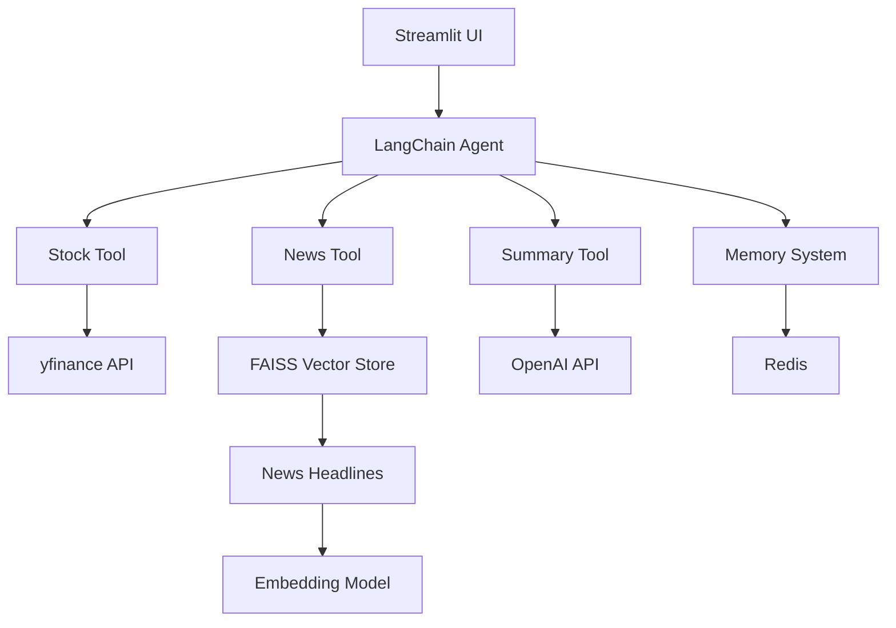

# 📊 LLM Financial Analysis Agent

A powerful AI-powered financial analysis agent that combines real-time stock data, intelligent news retrieval, and LLM-powered insights into a seamless Streamlit application.

## ✨ Features

- 🔴 **Real-time Stock Data**: Live quotes, price history, and key financial metrics
- 🧠 **Intelligent News Analysis**: Vector-based news retrieval with semantic search
- 🤖 **LLM-Powered Summaries**: Context-aware financial analysis using OpenAI
- 💾 **Persistent Memory**: Redis-backed conversation history
- 🔍 **Advanced Search**: FAISS vector store for efficient news retrieval
- 📈 **Multi-stock Comparison**: Compare multiple companies side-by-side
- 🚀 **Docker Ready**: Easy deployment with Docker Compose

## 🏗️ Architecture



## 📁 Project Structure

```
├── agent.py              # Main LangChain agent configuration
├── main.py               # Streamlit application entry point
├── memory.py             # Redis-based memory management
├── tools/                # Core functionality modules
│   ├── stock_tool.py     # Real-time stock data fetching
│   ├── news_tool.py      # Vector-based news retrieval
│   ├── summary_tool.py   # LLM-powered financial analysis
│   ├── vector_store.py   # FAISS vector store management
│   ├── retrieval_tool.py # Document retrieval logic
│   ├── ingest_tool.py    # News ingestion pipeline
│   └── resolve_tool.py   # Company name resolution
├── prompts/              # LLM prompt templates
│   └── templates.py      # Summary and analysis prompts
├── vector_index/         # FAISS vector indices
├── requirements.txt      # Python dependencies
├── docker-compose.yml    # Docker deployment configuration
└── Dockerfile           # Container configuration
```

## 🚀 Quick Start

### Prerequisites

- Python 3.8+
- Redis server
- OpenAI API key

### Installation

1. **Clone the repository**
   ```bash
   git clone https://github.com/yourusername/LLM-Financial-Analysis-Agent.git
   cd LLM-Financial-Analysis-Agent
   ```

2. **Set up environment**
   ```bash
   # Create virtual environment
   python -m venv .venv
   
   # Activate virtual environment
   # Windows
   .\.venv\Scripts\Activate.ps1
   # macOS/Linux
   source .venv/bin/activate
   ```

3. **Install dependencies**
   ```bash
   pip install -r requirements.txt
   ```

4. **Configure environment variables**
   Create a `.env` file in the root directory:
   ```env
   OPENAI_API_KEY=your_openai_api_key_here
   OPENAI_API_BASE=https://api.openai.com/v1  # Optional: for custom endpoints
   REDIS_URL=redis://localhost:6379
   ```

5. **Start Redis server**
   ```bash
   # Using Docker
   docker run -d -p 6379:6379 redis:alpine
   
   # Or install locally and run
   redis-server
   ```

6. **Run the application**
   ```bash
   streamlit run main.py
   ```

7. **Access the application**
   Open your browser to `http://localhost:8501`

## 🐳 Docker Deployment

### Using Docker Compose (Recommended)

```bash
# Build and start the application
docker-compose up --build -d

# View logs
docker-compose logs -f

# Stop the application
docker-compose down
```

### Manual Docker Build

```bash
# Build the image
docker build -t llm-financial-agent .

# Run the container
docker run -p 8501:8501 -e OPENAI_API_KEY=your_key llm-financial-agent
```

## 💡 Usage Examples

### Basic Stock Analysis
```
"Analyze AAPL stock performance"
"Show me the latest news about Tesla"
"What's happening with Microsoft's AI strategy?"
```

### Comparative Analysis
```
"Compare Apple and Google stock performance"
"Analyze the tech sector: AAPL, MSFT, GOOGL"
```

### Topic-Specific Queries
```
"Summarize Apple's latest AI chip development"
"What are the key drivers behind Tesla's recent performance?"
"Analyze Microsoft's cloud computing strategy"
```

## 🔧 Configuration

### Environment Variables

| Variable | Description | Required | Default |
|----------|-------------|----------|---------|
| `OPENAI_API_KEY` | OpenAI API key for LLM functionality | Yes | - |
| `OPENAI_API_BASE` | Custom OpenAI API endpoint | No | `https://api.openai.com/v1` |
| `REDIS_URL` | Redis connection URL | No | `redis://localhost:6379` |

### Vector Store Configuration

The application automatically manages FAISS vector stores for efficient news retrieval. Vector indices are stored in the `vector_index/` directory and are created on-demand when news ingestion occurs.

## 🛠️ Development

### Running Tests

```bash
# Run all tests
pytest

# Run specific test file
pytest tests/test_stock_tool.py
```

### Code Structure

- **Agent Layer**: `agent.py` - Main LangChain agent with tool integration
- **Tool Layer**: `tools/` - Modular tools for specific functionalities
- **Memory Layer**: `memory.py` - Redis-based conversation persistence
- **UI Layer**: `main.py` - Streamlit interface with streaming support

### Adding New Tools

1. Create a new tool file in `tools/`
2. Implement the tool function
3. Add tool registration in `agent.py`
4. Update the agent's tool list

## 📊 Performance

- **Vector Search**: FAISS-based similarity search for sub-second news retrieval
- **Caching**: Intelligent caching for stock data and relevance judgments
- **Streaming**: Real-time response streaming for better UX
- **Memory Management**: Efficient Redis-based conversation storage

## 🤝 Contributing

1. Fork the repository
2. Create a feature branch (`git checkout -b feature/amazing-feature`)
3. Commit your changes (`git commit -m 'Add amazing feature'`)
4. Push to the branch (`git push origin feature/amazing-feature`)
5. Open a Pull Request

## 📝 License

This project is licensed under the MIT License - see the [LICENSE](LICENSE) file for details.

## 🙏 Acknowledgments

- [LangChain](https://github.com/langchain-ai/langchain) for the agent framework
- [Streamlit](https://streamlit.io/) for the web interface
- [yfinance](https://github.com/ranaroussi/yfinance) for stock data
- [FAISS](https://github.com/facebookresearch/faiss) for vector similarity search
- [OpenAI](https://openai.com/) for LLM capabilities

## 📞 Support

If you encounter any issues or have questions:

1. Check the [Issues](https://github.com/yourusername/LLM-Financial-Analysis-Agent/issues) page
2. Create a new issue with detailed information
3. Join our [Discussions](https://github.com/yourusername/LLM-Financial-Analysis-Agent/discussions) for community support

---

**⭐ Star this repository if you find it helpful!**